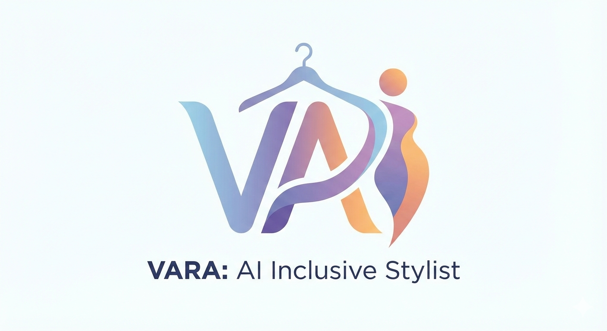

  

# 👗 VARA: AI-Driven Inclusive Personal Stylist

**VARA** is a high-performance fashion assistant built with **React** and **Gemini 2.5 Flash**. It solves the "nothing to wear" dilemma by combining real-time environmental data with a body-positive virtual try-on experience.

## 🚀 Technical Highlights

* **Virtual Try-On Engine:** Leveraging Gemini 2.5 Flash to intelligently "stitch" user garments onto customizable fit profiles.
* **Contextual Logic:** Integrates the Open-Meteo API for real-time weather detection to ensure outfit recommendations are practical.
* **Body-Positive UX:** A selection-first interface designed to lead with positivity and ensure inclusivity for all users.
* **Automated State Management:** Custom logic to parse AI-generated indices and programmatically update the virtual shelf.
